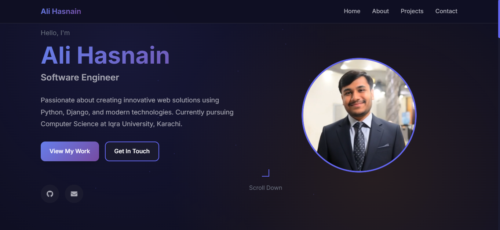
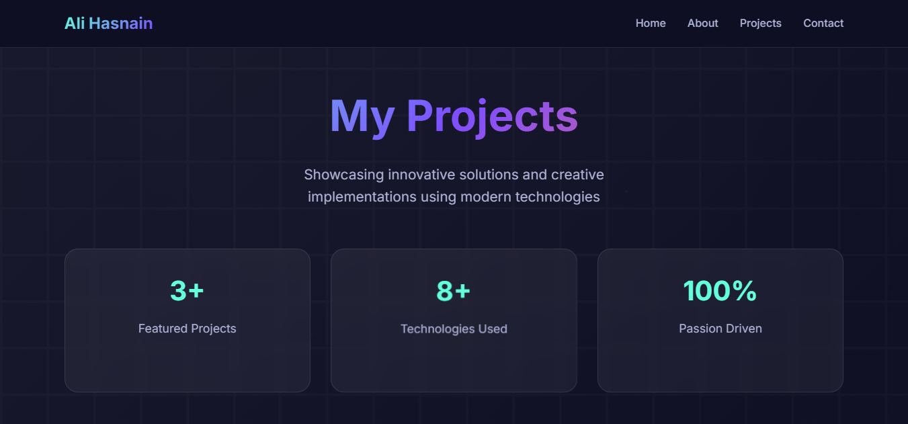
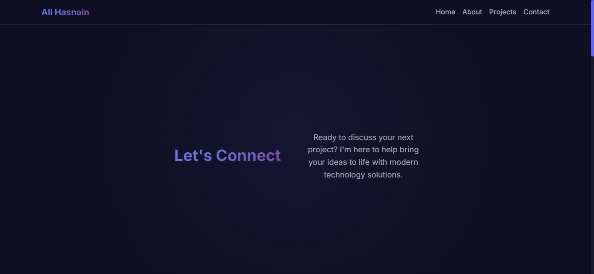
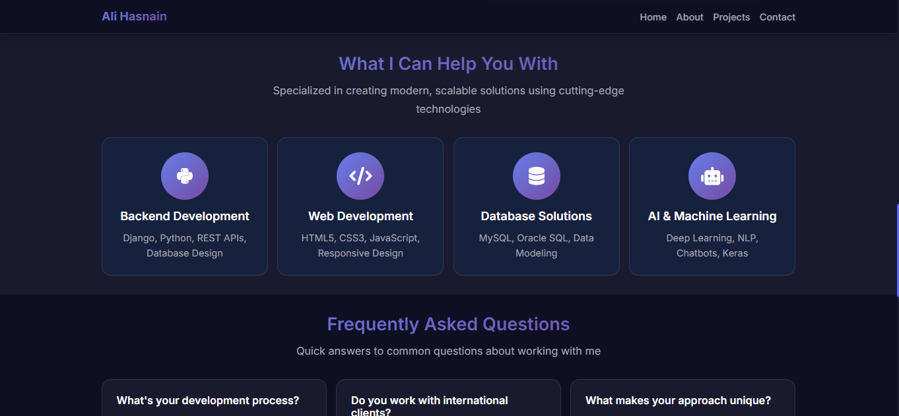

# 🌟 Portfolio Project

<div align="center">


**A modern, responsive portfolio website built with Django**

[🚀 Live Demo](https://your-portfolio-url.com) • [📁 View Code](https://github.com/alihasnain92/Portfolio-Project) • [🐛 Report Bug](https://github.com/alihasnain92/Portfolio-Project/issues)

</div>

---

## 📸 **Screenshots**

<div align="center">

### 🏠 Home Page


### 💼 Projects Showcase


### 👨‍💻 About Section


### 📧 Contact Form


</div>

---

## ✨ **Features**

🎨 **Modern UI/UX Design** - Clean, professional, and visually appealing interface

📱 **Fully Responsive** - Optimized for desktop, tablet, and mobile devices

🚀 **Fast Performance** - Lightweight and optimized for speed

💼 **Project Showcase** - Dynamic gallery of portfolio projects with descriptions

📝 **Contact System** - Functional contact form with validation

🔐 **Admin Dashboard** - Easy content management through Django admin

🎯 **SEO Optimized** - Proper meta tags and semantic HTML structure

⚡ **Easy Deployment** - Ready for deployment on various platforms

---

## 🛠️ **Tech Stack**

| Technology | Purpose |
|------------|---------|
| **Django** | Backend framework |
| **Python** | Server-side programming |
| **HTML5** | Page structure |
| **CSS3** | Styling and animations |
| **JavaScript** | Interactive features |
| **SQLite** | Database |

---

## 🚀 **Quick Start**

### **Prerequisites**
- Python 3.8+ installed
- Git installed
- Basic knowledge of Django

### **Installation**

1. **Clone the repository**
   ```bash
   git clone https://github.com/alihasnain92/Portfolio-Project.git
   cd Portfolio-Project
   ```

2. **Set up virtual environment**
   ```bash
   python -m venv venv
   venv\Scripts\activate  # Windows
   # source venv/bin/activate  # macOS/Linux
   ```

3. **Install dependencies**
   ```bash
   pip install django
   ```

4. **Configure environment**
   ```bash
   # Create .env file with your settings
   echo SECRET_KEY=your-secret-key-here > .env
   ```

5. **Set up database**
   ```bash
   cd portfolio
   python manage.py makemigrations
   python manage.py migrate
   ```

6. **Create admin user**
   ```bash
   python manage.py createsuperuser
   ```

7. **Run development server**
   ```bash
   python manage.py runserver
   ```

8. **Open browser**
   ```
   🌐 Navigate to: http://127.0.0.1:8000/
   ```

---

## 📁 **Project Structure**

```
MY_PORTFOLIO/
├── 📁 portfolio/              # Main Django project
│   ├── 📁 main/              # Portfolio app
│   │   ├── 📁 templates/     # HTML templates
│   │   ├── 📁 migrations/    # Database migrations
│   │   ├── 🐍 models.py      # Data models
│   │   ├── 🐍 views.py       # View logic
│   │   ├── 🐍 urls.py        # URL routing
│   │   └── 🐍 admin.py       # Admin configuration
│   ├── 📁 portfolio/         # Project settings
│   ├── 📁 static/            # Static files (CSS, images)
│   ├── 🗄️ db.sqlite3         # Database file
│   └── 🐍 manage.py          # Django management script
├── 📁 venv/                  # Virtual environment
├── 🔒 .env                   # Environment variables
├── 📋 .gitignore             # Git ignore rules
└── 📖 README.md              # Project documentation
```

---

<div align="center">

**Made with ❤️ by Ali Hasnain**

*© 2025 Portfolio Project. All rights reserved.*

</div>